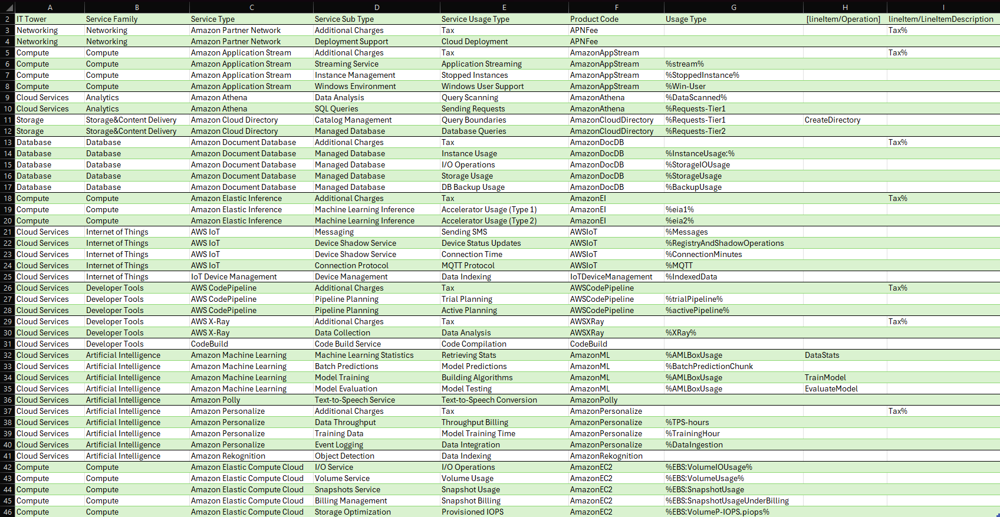

# Лабораторная работа 1. Знакомство с IaaS, PaaS, SaaS сервисами в облаке на примере Amazon Web Services (AWS). Создание сервисной модели.

## Описание лабораторной работы
### Цель работы
Получение навыков аналитики и понимания спектра публичных облачных сервисов без привязки к вендору. Формирование у студентов комплексного видения Облака. 
### Дано 
- Слепок данных биллинга от провайдера после небольшой обработки в виде SQL-параметров. Символ % в начале/конце означает, что перед/после него может стоять любой набор символов.
- Образец итогового соответствия, что желательно получить в конце. В этом же документе
### Необходимо 
- Импортировать файл .csv в Excel или любую другую программу работы с таблицами. Для Excel делается на вкладке Данные – Из текстового / csv файла – выбрать файл, разделитель – точка с запятой.
- Распределить потребление сервисов по иерархии, чтобы можно было провести анализ от большего к меньшему (напр. От всех вычислительных ресурсов Compute дойти до конкретного типа использования - Выделенной стойка в датацентре Dedicated host usage).
- Сохранить файл и залить в соответствующую папку на Google Drive.
### Алгоритм работы 
Сопоставить входящие данные от провайдера с его же документацией. Написать в соответствие колонкам справа значения 5 колонок слева, которые бы однозначно классифицировали тип сервиса. Для столбцов IT Tower и Service Family значения можно выбрать из образца.

## Ход выполнения работы 
До:

После:

## Встреченные сервисы
#### APNFee (AWS Partner Network Fee)
Это сервис для автоматического расчёта и учёта комиссионных сборов, которые партнеры AWS должны платить за использование определённых облачных услуг AWS.
#### Amazon AppStream
Полностью управляемый сервис потоковой передачи приложений, который позволяет пользователям запускать десктопные приложения в облаке.
#### Amazon Athena
Сервис для анализа данных в Amazon S3 с использованием SQL. Athena позволяет выполнять запросы к данным в формате CSV, JSON, Parquet и других без необходимости загружать их в базы данных.
#### Amazon CloudDirectory
Сервис для создания и управления многомерными каталогами данных, таких как каталоги пользователей, устройств и организаций.
#### Amazon DocumentDB
Управляемая база данных, совместимая с MongoDB, предоставляющая гибкость NoSQL базы данных с высокой доступностью и масштабируемостью.
#### Amazon Elastic Inference
Позволяет ускорять выполнение моделей машинного обучения, уменьшая стоимость использования графических процессоров.
#### AWS IoT
Платформа для подключения устройств к облаку AWS и обмена данными с другими сервисами.Также позволяет управлять устройствами и их состоянием, и остслеживать их активность.
#### AWS CodePipeline
Сервис для автоматизации процессов доставки и интеграции программного обеспечения. Позволяет настроить конвейеры для сборки, тестирования и деплоя.
#### AWS X-Ray
Сервис для мониторинга и диагностики распределённых приложений. Он помогает анализировать и устранять проблемы в приложениях.
#### AWS CodeBuild
Сервис для автоматической сборки исходного кода. С его помощью можно компилировать код и тестировать его для дальнейшей разработки. Интегрируется с другими сервисами CI/CD, такими как CodePipeline
#### Amazon ML
набор инструментов для создания и внедрения моделей машинного обучения. Предлагает понятные инструменты для обучения моделей без необходимости глубоких знаний в области ML.
#### Amazon Polly
Сервис для преобразования текста в речь. Amazon Polly использует нейронные сети для генерации естественной речи, поддерживает множество языков и голосов.
#### Amazon Personalize
Сервис для создания персонализированных рекомендаций. Он использует машинное обучение для анализа данных о пользователях и предоставляет рекомендации для продуктов и услуг.
#### Amazon Rekognition
Используется для анализа изображений и видео с использованием глубокого обучения. Rekognition может распознавать объекты, текст, лица и сцены в изображениях и видео.
#### Amazon EC2
Предоставляет вычислительные ресурсы в виде виртуальных серверов.

## Вывод
Прочитал документацию, проанализировал биллинг и описал различные сервисы AWS. Увидел, что AWS предоставляет огромный спектр услуг для огромного количества задач.
