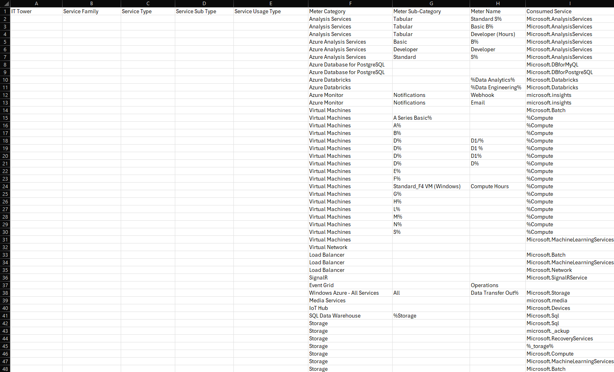
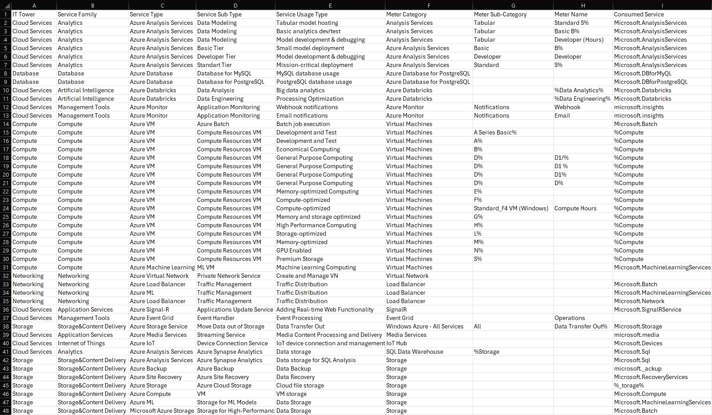

# Лабораторная работа 2. Сравнение сервисов Amazon Web Services и Microsoft Azure. Создание единой кросс-провайдерной сервисной модели.

## Описание лабораторной работы
### Цель работы
Получение навыков аналитики и понимания спектра публичных облачных сервисов без привязки к вендору. Формирование у студентов комплексного видения Облака. 
### Дано 
- Данные лабораторной работы 1.
- Слепок данных биллинга от провайдера после небольшой обработки в виде SQL-параметров. Символ % в начале/конце означает, что перед/после него может стоять любой набор символов.
- Образец итогового соответствия, что желательно получить в конце. В этом же документе.
### Необходимо 
- Импортировать файл .csv в Excel или любую другую программу работы с таблицами. Для Excel делается на вкладке Данные – Из текстового / csv файла – выбрать файл, разделитель – точка с запятой.
- Распределить потребление сервисов по иерархии, чтобы можно было провести анализ от большего к меньшему (напр. От всех вычислительных ресурсов Compute дойти до конкретного типа использования - Выделенной стойка в датацентре Dedicated host usage). При этом сохранять логическую концепцию, выработанную в Лабораторной работе 1.
- Сохранить файл и залить в соответствующую папку на Google Drive.
### Алгоритм работы 
Сопоставить входящие данные от провайдера с его же документацией. Написать в соответствие колонкам справа значения 5 колонок слева, которые бы однозначно классифицировали тип сервиса. Для столбцов IT Tower и Service Family значения можно выбрать из образца. В ходе выполнения работы не отходить от принципов классификации, выбранных в Лабораторной работе 1. Например, если сервис Машинного обучения был разбит на Вычислительные мощности и Облачные сервисы, то продолжать его разбивать и в новых данных.

## Работа 
До:

После:

## Встреченные сервисы
#### Azure Analysis Services
Предоставляет модели данных корпоративного уровня для анализа данных. Может быть развернут как в Azure, так и локально.
#### Azure Database
Семейство служб баз данных, предлагающих различные варианты управляемых баз данных в облаке
#### Azure Databricks
Сервис аналитики на основе Apache Spark, оптимизированный для облака Azure. Используется для обработки больших данных, машинного обучения и анализа данных.
#### Azure Azure Monitor
Сервис для мониторинга ресурсов и приложений Azure, предоставляющее информацию о производительности, доступности и использовании.
#### Azure Virtual Machines
Позволяет создавать и управлять виртуальными машинами в облаке, предоставляя вычислительные ресурсы.
#### Azure Machine Learning
Широкая категория, которая включает различные инструменты и сервисы для создания, обучения и развертывания моделей машинного обучения.
#### Azure Virtual Network
Позволяет создавать изолированные сети в Azure, которые обеспечивают безопасную связь для ресурсов.
#### Azure Load Balancer
Распределяет сетевой трафик между несколькими ресурсами для повышения доступности приложений.
#### Azure Azure Signal-R
Сервис для добавления функций реального времени в веб-приложения, таких как чат, интерактивные панели и уведомления.
#### Azure Event Grid
Полностью управляемая служба маршрутизации событий, позволяет создавать архитектуры, управляемые событиями, и бессерверные рабочие процессы.
#### Azure Media Services
Платформа для создания различных процессов с мультимедиа в облаке, включая кодирование, упаковку и потоковую передачу видео и аудиоконтента.
#### Azure IoT
Охватывает ряд сервисов и технологий для подключения, мониторинга и управления устройствами Интернета вещей.
#### Azure Backup
Сервис резервного копирования и восстановления ресурсов Azure и локальных данных. Он автоматизирует процесс резервирования и обеспечивает надежность.
#### Azure Storage
Сервис для хранения данных, например, неструктурированных данных(фото, видео), данных NoSQL, очередей.

## Вывод
Прочитал документацию, проанализировал биллинг и описал различные сервисы. В общем познакомился с сервисами Azure и понял, что и Azure и AWS предоставляют огромный список сервисов для различных ситуаций.
