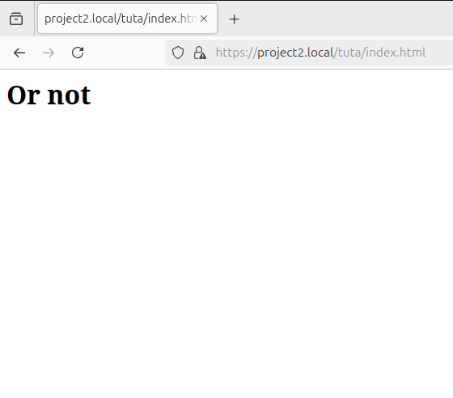

# Отчёт по лабораторной работе DevOps1


### Техническое задание:
Настроить Nginx таким образом, чтобы выполнялись следующие требования
1. Подключение осуществлялось через протокол https с сертификатом;
2. Настроить принудительное перенаправление HTTP-запросов (порт 80) на HTTPS (порт 443) для обеспечения безопасного соединения;
3. Использовать alias для создания псевдонимов путей к файлам или каталогам на сервере;
4. Настроить виртуальные хосты для обслуживания нескольких доменных имен на одном сервере.

### Работаем


Для начала обновим пакеты и установим Nginx, используя команды:

```bash
sudo apt-get update
```

```bash
sudo apt install nginx
```

Для работы с HTTPS нужно создать самоподписанные SSL-сертификаты для доменов `project1.local` и `project2.local`.

Зачем самоподписанные? 
Да потому что так проще.(Дедлайн горит)

Создадим директорию для хранения сертификатов

```bash
sudo mkdir -p /etc/nginx/ssl
```
Для создания сертификатов использовали следующую команду:
   ```bash
   sudo openssl req -x509 -nodes -days 365 -newkey rsa:2048 -keyout /etc/nginx/ssl/project1.key -out /etc/nginx/ssl/project1.crt -subj "/CN=project1.local"
   ```


Аналогично для второго проекта


Далее настроим виртуальные хосты Nginx

Открываем файлы конфигурации командой:
```bash
sudo nano /etc/nginx/sites-available/project1.local
```
И вводим туда


Сохраняем(CTRL+O) и закрываем(CTRL+X)

И для второго


Чуть не забыл, нужно создать тестовые страницы

Создаем и открываем с помощью команд
```bash
sudo nano /var/www/project1/index.html
sudo nano /var/www/project2/index.html
```
Туда вводим что хотим, и теперь можно заходить в браузер и проверять(браузер будет жаловаться, но это уже его проблемы), вот например:


Все отлично! Осталось добавить alias, чтобы не вбивать полный путь.

Итак, в папках с нашими проектами нужно создать ещё папок и добавить туда тестовые страницы.

После этого открываем файлы кофигураций и дополняем их


Снова открываем браузер и проверяем, что все работает




Всё прекрасно работает.