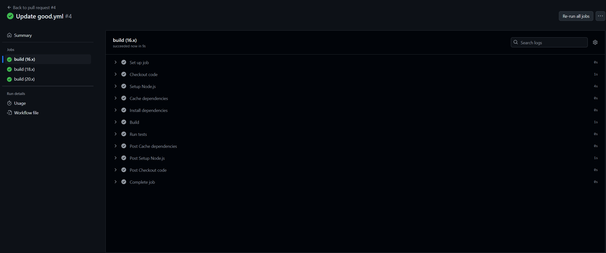

# Лабораторная работа 3

В этой лабе создадим "хорошие" и "плохие" CI/CD файлы, опишем плохие практики, пофиксим и расскажем что и почему.

## Пример "плохого" CI/CD

```
name: Bad CI/CD

on:
  push:
    branches:
      - master 

jobs:
  build:
    runs-on: ubuntu-latest
    steps:
      - uses: actions/checkout@v3
      - name: Set up Node.js
        uses: actions/setup-node@v3
        with:
          node-version: latest
      - name: Install dependencies
        run: npm install
      - name: Build
        run: npm run build

```

### А минусы где?
1. **Установка версий `latest`**: 
  Использование `latest` может привести к странным результатам, так как сборка может ломаться из-за неожиданных изменений в новых версях.

2. **Отсутствие кэширования зависимостей**:
  Каждый раз при запуске сборки зависимости устанавливаются заново, что замедляет процесс.

3. **Запуск пайплайна только для `master`**:
  Все задания выполняются только для ветки `master`, это ограничит возможность проверить код на других ветках, следовательно ошибки будет сложнее обнаружить.

4. **Отсутствие тестирования на разных версиях**:
  Тестирование только на одной версии Node.js может скрыть проблемы совместимости с другими версиями.

5. **Использование устаревшей команды для деплоя**:
  Без запуска CI на Pull Requests, ошибки обнаруживаются только после слияния в основную ветку, что усложнит процесс их исправления.

## Пример "хорошего"(относительно) CI/CD

```
name: Good CI

on:
  push:
    branches:
      - main 
  pull_request: 
    branches:
      - main

jobs:
  build:
    runs-on: ubuntu-22.04
    strategy:
      matrix:
        node-version: [16.x, 18.x, 20.x] 
    steps:
      - name: Checkout code
        uses: actions/checkout@v3
      - name: Setup Node.js
        uses: actions/setup-node@v3
        with:
          node-version: ${{ matrix.node-version }}
      - name: Cache dependencies # Исправление 2: Кэширование
        uses: actions/cache@v3
        with:
          path: ~/.npm
          key: ${{ runner.os }}-node-${{ matrix.node-version }}-${{ hashFiles('package-lock.json') }}
          restore-keys: |
            ${{ runner.os }}-node-${{ matrix.node-version }}-
      - name: Install dependencies
        run: npm ci
      - name: Build
        run: npm run build
      - name: Run tests
        run: npm test

```
### Разница

1. Выбрали конкретные версии, теперь пайплайн будет более стабильным и перестанет зависеть от совместимостей с последней версией.

2. Сейчас мы использовали `actions/cache`, который кэширует зависимости, что значительно ускорило сборку.

3. В хорошем примере пайплайн запускается для ветки `main`, это позволит выявлять баги раньше.

4. Использование матрицы версий Node.js позволяет протестировать код на нескольких версиях, что точно повысит надежность.

5. Теперь CI запускается и на событиях `pull_request`, что даст возможность выявлять и исправлять ошибки до слияния.



##  Вывод

  Васю жалко.
